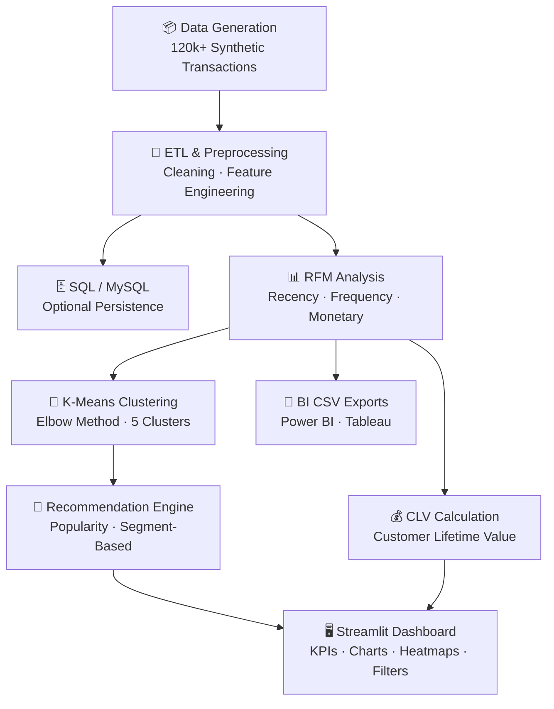
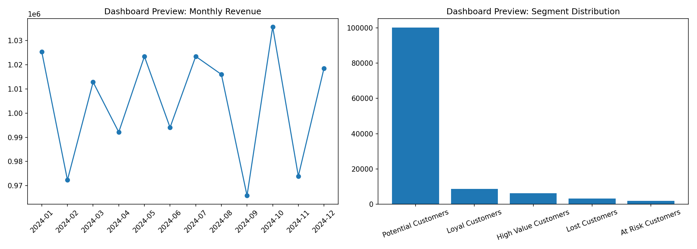

<div align="center">

# 🚀 Customer Behavior Analytics & Recommendation System

### End-to-End Customer Segmentation, Analytics & Personalized Recommendation Platform

<br>

[](https://www.python.org/)
[](https://pandas.pydata.org/)
[](https://numpy.org/)
[](https://scikit-learn.org/)
[](https://www.mysql.com/)

[](https://streamlit.io/)
[](https://plotly.com/)
[](https://jupyter.org/)
[](LICENSE)

</div>

---

## 📌 Overview

**Customer Behavior Analytics & Recommendation System** is a production-style, end-to-end analytics platform that ingests and processes large-scale customer transaction data, derives actionable business insights, and surfaces personalized product recommendations through an interactive dashboard.

The system covers the full analytics lifecycle:

| Stage | What happens |
|---|---|
| **Data Generation & ETL** | Synthetic 120k+ transaction records, cleaning, feature engineering |
| **RFM Analysis** | Recency, Frequency, Monetary scoring → named customer segments |
| **K-Means Clustering** | Unsupervised behavioral grouping with Elbow-Method tuning |
| **CLV Tracking** | Customer Lifetime Value calculation and leaderboard |
| **Recommendation Engine** | Popularity-based and segment-aware product suggestions |
| **Interactive Dashboard** | Streamlit app with KPI cards, charts, heatmaps, and filters |
| **BI Exports** | Power BI / Tableau-compatible CSV files |

---

## 🎯 Key Highlights

✅ Processes **120,000+ synthetic customer transaction records** across 12,000 customers  
✅ Complete **ETL pipeline** — data generation, cleaning, and feature engineering  
✅ **RFM segmentation** (High Value → Lost) mapped to named business segments  
✅ **K-Means clustering** with Elbow Method for optimal `k` selection  
✅ **Dual recommendation strategy** — popularity-based and segment-based  
✅ **Interactive Streamlit dashboard** with city/category filters, KPI cards, and charts  
✅ **MySQL integration** for production-grade data persistence (optional)  
✅ **BI-compatible CSV exports** (`bi_monthly_sales_export.csv`) for Power BI / Tableau  
✅ Unit-tested pipeline with `unittest`  

---

## 🏗️ System Architecture



---

## ✨ Features

### 📊 Customer Analytics

- Monthly revenue trend analysis
- Customer Lifetime Value (CLV) calculation and ranking
- Repeat vs. first-time customer analysis
- Purchase frequency tracking per customer
- Product category revenue performance
- Segment-wise revenue breakdown
- Customer retention insights (active months)
- Top-N high-value customer leaderboard

### 🧠 Machine Learning & Segmentation

| Technique | Details |
|---|---|
| **RFM Scoring** | Quantile-based R/F/M scores (1–5), combined RFM string → named segment |
| **K-Means Clustering** | StandardScaler → KMeans, configurable `n_clusters` (default 5) |
| **Elbow Method** | Inertia curve for `k = 2…10` exported to `data/elbow_method.csv` |
| **Cluster Visualization** | Recency vs. Monetary scatter saved to `visualizations/cluster_scatter.png` |

RFM segments produced:

| Segment | Meaning |
|---|---|
| High Value Customers | Best customers — recent, frequent, high spend |
| Loyal Customers | Regular buyers with strong engagement |
| Potential Customers | Growing, not yet top-tier |
| At Risk Customers | Were good customers, now fading |
| Lost Customers | Lowest recency, frequency, and spend |

### 🎯 Recommendation Engine (`recommendation/engine.py`)

- **Popularity-based** — ranks all categories by revenue + demand; filters out categories the customer already purchased from
- **Segment-based** — finds the customer's RFM segment and ranks categories by transaction count within that segment; falls back to popularity-based when segment data is unavailable

### 📈 Streamlit Dashboard (`dashboard/streamlit_app.py`)

- KPI cards: Total Revenue, Unique Customers, Average Order Value
- Monthly revenue line chart (Plotly)
- RFM segment distribution bar chart
- Top 20 CLV customers bar chart
- Category × Month revenue heatmap
- Top customers data table
- Sidebar filters: City, Product Category, Customer ID
- Personalized recommendations panel (popularity + segment)

---

## 🧰 Tech Stack

| Category | Library / Tool | Version |
|---|---|---|
| Language | Python | 3.10+ |
| Data Analysis | Pandas | ≥ 2.0 |
| Numerical Computing | NumPy | ≥ 1.24 |
| Machine Learning | Scikit-Learn | ≥ 1.3 |
| Visualization | Plotly, Matplotlib, Seaborn | ≥ 5.20 / 3.7 / 0.13 |
| Dashboard | Streamlit | ≥ 1.34 |
| Database (optional) | MySQL + SQLAlchemy + PyMySQL | ≥ 2.0 / 1.1 |
| Notebook | Jupyter | ≥ 1.0 |

---

## 📂 Project Structure

```text
Customer-Behavior-Analytics-and-Recommendation-System/
│
├── dashboard/
│   └── streamlit_app.py          # Interactive Streamlit dashboard
│
├── data/                         # Generated data files (created by main.py)
│   ├── transactions_raw.csv
│   ├── transactions_processed.csv
│   ├── transactions_enriched.csv # With RFM segment + cluster labels
│   ├── rfm_segments.csv
│   ├── elbow_method.csv
│   ├── customer_clv.csv
│   └── bi_monthly_sales_export.csv
│
├── models/
│   ├── __init__.py
│   ├── analytics.py              # CLV, revenue trend, retention, top customers
│   ├── clustering.py             # K-Means, Elbow Method, cluster scatter plot
│   └── rfm.py                    # RFM scoring and segment labelling
│
├── notebooks/
│   └── customer_behavior_analysis.ipynb  # EDA and experimentation notebook
│
├── preprocessing/
│   ├── __init__.py
│   ├── data_pipeline.py          # Data generation, cleaning, feature engineering
│   └── sql_integration.py        # Optional MySQL load utilities
│
├── recommendation/
│   ├── __init__.py
│   └── engine.py                 # Popularity-based & segment-based recommenders
│
├── reports/
│   └── sample_report.md          # Sample business insights summary
│
├── screenshots/
│   └── dashboard.png             # Dashboard preview screenshot
│
├── sql/
│   ├── __init__.py
│   ├── schema.sql                # MySQL table definitions
│   ├── analytics_queries.sql     # Pre-written analytical SQL queries
│   └── query_module.py           # Python wrapper to run SQL queries
│
├── tests/
│   └── test_pipeline.py          # Unit tests for ETL, RFM, and recommendation logic
│
├── visualizations/
│   ├── plots.py                  # Plotly chart builders (revenue, heatmap, segments)
│   └── cluster_scatter.png       # K-Means cluster scatter (generated by main.py)
│
├── main.py                       # Pipeline entry point — run this first
├── requirements.txt
└── README.md
```

---

## ⚙️ Installation & Setup

### Prerequisites

| Tool | Version | Notes |
|---|---|---|
| Python | 3.10+ | [python.org](https://www.python.org/downloads/) |
| pip | latest | Bundled with Python |
| Git | any | [git-scm.com](https://git-scm.com/) |
| MySQL | 8.0+ | **Optional** — only needed for SQL integration |

---

### Step 1 — Clone the repository

```bash
git clone https://github.com/swain2003/Customer-Behavior-Analytics-and-Recommendation-System.git
cd Customer-Behavior-Analytics-and-Recommendation-System
```

---

### Step 2 — Create and activate a virtual environment

**Windows (PowerShell)**

```powershell
python -m venv .venv
.venv\Scripts\Activate.ps1
```

**Linux / macOS**

```bash
python -m venv .venv
source .venv/bin/activate
```

---

### Step 3 — Install dependencies

```bash
pip install -r requirements.txt
```

> **Tip:** If you hit permission issues, add the `--user` flag:  
> `pip install --user -r requirements.txt`

---

### Step 4 — Run the data pipeline

This generates all datasets and the cluster scatter plot:

```bash
python main.py
```

To customize the number of synthetic records:

```bash
python main.py --rows 50000
```

After a successful run, the `data/` directory will contain:

```
transactions_raw.csv
transactions_processed.csv
transactions_enriched.csv   ← required by the dashboard
rfm_segments.csv
elbow_method.csv
customer_clv.csv
bi_monthly_sales_export.csv
```

---

### Step 5 — Launch the interactive dashboard

```bash
streamlit run dashboard/streamlit_app.py
```

Open your browser at **[http://localhost:8501](http://localhost:8501)**

> **Note:** `python main.py` must be run at least once before launching the dashboard. The app reads `data/transactions_enriched.csv` and will display an error if the file is missing.

---

### Step 6 — (Optional) Explore the Jupyter notebook

```bash
jupyter notebook
```

Open `notebooks/customer_behavior_analysis.ipynb` for interactive EDA, segmentation experiments, and visualization prototyping.

---

### Step 7 — (Optional) MySQL integration

1. Create the database and schema:

   ```sql
   -- Run schema.sql against your MySQL instance
   mysql -u root -p < sql/schema.sql
   ```

2. Configure the connection in `preprocessing/sql_integration.py` (host, user, password, database).

3. The pipeline will then persist processed records to MySQL in addition to CSV.

---

## 🧪 Running Tests

```bash
python -m unittest tests/test_pipeline.py -v
```

The test suite covers:

| Test | What is verified |
|---|---|
| `test_required_columns_exist_after_preprocessing` | All expected columns present after ETL |
| `test_rfm_segmentation_outputs_labels` | RFM table contains `rfm_segment` with multiple distinct labels |
| `test_recommendations_return_ranked_categories` | Recommendations return ≤ N string category names |

---

## 📊 Generated Outputs Reference

| File | Description |
|---|---|
| `data/transactions_raw.csv` | Raw synthetic transactions (before cleaning) |
| `data/transactions_processed.csv` | Cleaned dataset with engineered features |
| `data/transactions_enriched.csv` | Processed + RFM segment + cluster labels |
| `data/rfm_segments.csv` | Per-customer RFM scores and segment labels |
| `data/elbow_method.csv` | Inertia values for k = 2…10 |
| `data/customer_clv.csv` | Customer Lifetime Value ranked table |
| `data/bi_monthly_sales_export.csv` | Monthly revenue by category (Power BI / Tableau) |
| `visualizations/cluster_scatter.png` | Recency × Monetary cluster scatter plot |

---

## 📈 Machine Learning Workflow

### RFM Analysis

Each customer receives quantile-based scores (1 = lowest, 5 = highest) for:

- **Recency** — days since last purchase (lower is better → score 5)
- **Frequency** — total transaction count (higher is better → score 5)
- **Monetary** — total spend (higher is better → score 5)

The three scores are concatenated into an RFM string (e.g. `"554"`) and mapped to a named segment.

### K-Means Clustering

1. Features — `Recency`, `Frequency`, `Monetary`
2. Normalized with `StandardScaler`
3. `KMeans(n_clusters=5, n_init=10, random_state=42)` fit on normalized data
4. Cluster IDs written back to the RFM table and the enriched transactions file
5. Elbow curve exported to `data/elbow_method.csv` for visual cluster selection

---

## 💼 Business Impact

| Use Case | How this project helps |
|---|---|
| **Targeted marketing** | Identify High Value / At Risk segments for campaign prioritization |
| **Customer retention** | Track active months and recency to flag churning customers |
| **Personalised offers** | Segment- and popularity-based category recommendations per customer |
| **Revenue forecasting** | Monthly revenue trend data ready for BI tools |
| **Category strategy** | Revenue and transaction counts per product category |
| **Executive reporting** | CLV leaderboard and KPI cards in the dashboard |

---

## 🔮 Future Improvements

- [ ] Real-time streaming pipeline with Apache Kafka / Spark
- [ ] Collaborative filtering or matrix-factorization recommendation model
- [ ] REST API (FastAPI) to expose recommendations and analytics endpoints
- [ ] Cloud deployment (AWS / GCP / Azure) with containerisation (Docker)
- [ ] User authentication for the Streamlit dashboard
- [ ] Automated model retraining with Airflow or Prefect
- [ ] Deep learning embeddings for customer representation

---

## 📸 Dashboard Preview



---

## 👨‍💻 Author

**Anubhaba Swain**  
B.Tech in Information Technology | KIIT University

[](https://www.linkedin.com/in/anubhaba-swain-695a7b176)
[](https://github.com/swain2003)

---

## ⭐ Support

If you found this project useful, please consider giving it a ⭐ on GitHub — it helps others discover the project!

---

