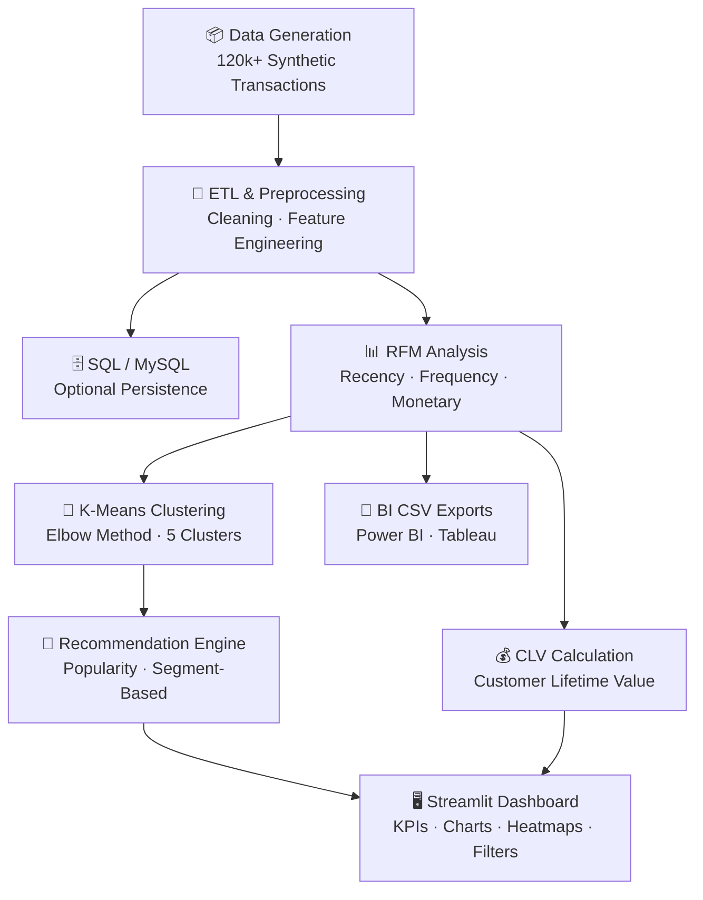

<div align="center">

# 🚀 Customer Behavior Analytics & Recommendation System

### End-to-End Customer Segmentation, Analytics & Personalized Recommendation Platform

<br>

[](https://www.python.org/)
[](https://pandas.pydata.org/)
[](https://numpy.org/)
[](https://scikit-learn.org/)
[](https://www.mysql.com/)
[](https://www.sqlalchemy.org/)
[](https://pymysql.readthedocs.io/)
[](https://streamlit.io/)
[](https://plotly.com/)
[](https://matplotlib.org/)
[](https://seaborn.pydata.org/)
[](https://jupyter.org/)
[](https://streamlit.io/cloud)
[](https://powerbi.microsoft.com/)
[](https://www.tableau.com/)
[](LICENSE)
[](https://customer-behavior-analytics-and-recommendation-system.streamlit.app/)

</div>

---

# 🌐 Live Deployment

🚀 Streamlit Cloud Deployment:  
https://customer-behavior-analytics-and-recommendation-system.streamlit.app/

---

## 📌 Overview

**Customer Behavior Analytics & Recommendation System** is a production-style, end-to-end analytics platform that ingests and processes large-scale customer transaction data, derives actionable business insights, and surfaces personalized product recommendations through an interactive dashboard.

The system covers the full analytics lifecycle:

| Stage | What happens |
|---|---|
| **Data Generation & ETL** | Synthetic 120k+ transaction records, cleaning, feature engineering |
| **RFM Analysis** | Recency, Frequency, Monetary scoring → named customer segments |
| **K-Means Clustering** | Unsupervised behavioral grouping with Elbow-Method tuning |
| **CLV Tracking** | Customer Lifetime Value calculation and leaderboard |
| **Recommendation Engine** | Popularity-based and segment-aware product suggestions |
| **Interactive Dashboard** | Streamlit app with KPI cards, charts, heatmaps, and filters |
| **BI Exports** | Power BI / Tableau-compatible CSV files |

---

## 🎯 Key Highlights

✅ Processes **120,000+ synthetic customer transaction records** across 12,000 customers  
✅ Complete **ETL pipeline** — data generation, cleaning, and feature engineering  
✅ **RFM segmentation** (High Value → Lost) mapped to named business segments  
✅ **K-Means clustering** with Elbow Method for optimal `k` selection  
✅ **Dual recommendation strategy** — popularity-based and segment-based  
✅ **Interactive Streamlit dashboard** with city/category filters, KPI cards, and charts  
✅ **MySQL integration** for production-grade data persistence (optional)  
✅ **BI-compatible CSV exports** (`bi_monthly_sales_export.csv`) for Power BI / Tableau  
✅ Unit-tested pipeline with `unittest`  
✅ Deployable on **Streamlit Cloud**  
✅ Modular architecture for scalability and production deployment  

---

## 🏗️ System Architecture



---

## ✨ Features

### 📊 Customer Analytics

- Monthly revenue trend analysis
- Customer Lifetime Value (CLV) calculation and ranking
- Repeat vs. first-time customer analysis
- Purchase frequency tracking per customer
- Product category revenue performance
- Segment-wise revenue breakdown
- Customer retention insights (active months)
- Top-N high-value customer leaderboard

---

### 🧠 Machine Learning & Segmentation

| Technique | Details |
|---|---|
| **RFM Scoring** | Quantile-based R/F/M scores (1–5), combined RFM string → named segment |
| **K-Means Clustering** | StandardScaler → KMeans, configurable `n_clusters` (default 5) |
| **Elbow Method** | Inertia curve for `k = 2…10` exported to `data/elbow_method.csv` |
| **Cluster Visualization** | Recency vs. Monetary scatter saved to `visualizations/cluster_scatter.png` |

---

### 🎯 Recommendation Engine (`recommendation/engine.py`)

#### Popularity-Based Recommendations
- Ranks categories using transaction count and revenue
- Removes categories already purchased by the customer
- Returns top-N categories

#### Segment-Based Recommendations
- Detects the customer's RFM segment
- Finds trending categories within that segment
- Falls back to popularity-based recommendations if insufficient data exists

---

### 📈 Streamlit Dashboard (`dashboard/streamlit_app.py`)

#### Dashboard Includes

- KPI cards
- Revenue trend charts
- Segment distribution charts
- Customer CLV rankings
- Revenue heatmaps
- Customer recommendation panel
- Interactive sidebar filters
- Downloadable data exports

#### Sidebar Filters
- City
- Product Category
- Customer ID

---

## 🧰 Tech Stack

| Category | Library / Tool | Version |
|---|---|---|
| Language | Python | 3.10+ |
| Data Analysis | Pandas | ≥ 2.0 |
| Numerical Computing | NumPy | ≥ 1.24 |
| Machine Learning | Scikit-Learn | ≥ 1.3 |
| Visualization | Plotly, Matplotlib, Seaborn | ≥ 5.20 / 3.7 / 0.13 |
| Dashboard | Streamlit | ≥ 1.34 |
| Database (optional) | MySQL + SQLAlchemy + PyMySQL | ≥ 2.0 / 1.1 |
| Notebook | Jupyter | ≥ 1.0 |

---

## 📂 Project Structure

```text
Customer-Behavior-Analytics-and-Recommendation-System/
│
├── dashboard/
│   └── streamlit_app.py
│
├── data/
│   ├── transactions_raw.csv
│   ├── transactions_processed.csv
│   ├── transactions_enriched.csv
│   ├── rfm_segments.csv
│   ├── elbow_method.csv
│   ├── customer_clv.csv
│   └── bi_monthly_sales_export.csv
│
├── models/
│   ├── analytics.py
│   ├── clustering.py
│   └── rfm.py
│
├── notebooks/
│   └── customer_behavior_analysis.ipynb
│
├── preprocessing/
│   ├── data_pipeline.py
│   └── sql_integration.py
│
├── recommendation/
│   └── engine.py
│
├── reports/
│   └── sample_report.md
│
├── screenshots/
│   └── dashboard.png
│
├── sql/
│   ├── schema.sql
│   ├── analytics_queries.sql
│   └── query_module.py
│
├── tests/
│   └── test_pipeline.py
│
├── visualizations/
│   ├── plots.py
│   └── cluster_scatter.png
│
├── .gitignore
├── requirements.txt
├── main.py
└── README.md
```

---

## ⚙️ Installation & Setup

### Prerequisites

| Tool | Version |
|---|---|
| Python | 3.10+ |
| pip | latest |
| Git | latest |
| MySQL | Optional |

---

## 🚀 Quick Start

### 1️⃣ Clone the Repository

```bash
git clone https://github.com/swain2003/Customer-Behavior-Analytics-and-Recommendation-System.git
cd Customer-Behavior-Analytics-and-Recommendation-System
```

---

### 2️⃣ Create Virtual Environment

#### Windows

```powershell
python -m venv .venv
.venv\Scripts\Activate.ps1
```

#### Linux/macOS

```bash
python -m venv .venv
source .venv/bin/activate
```

---

### 3️⃣ Install Dependencies

```bash
pip install -r requirements.txt
```

---

### 4️⃣ Run the Data Pipeline

```bash
python main.py
```

Custom rows:

```bash
python main.py --rows 50000
```

---

### 5️⃣ Launch Dashboard

```bash
streamlit run dashboard/streamlit_app.py
```

Open:

```text
http://localhost:8501
```

---

## ☁️ Streamlit Cloud Deployment

### Deploy in 5 Steps

1. Push project to GitHub
2. Visit Streamlit Cloud
3. Connect GitHub repository
4. Select:
   - Repository
   - Branch
   - `dashboard/streamlit_app.py`
5. Click Deploy

### Live App

https://customer-behavior-analytics-and-recommendation-system.streamlit.app/

---

## 🧪 Running Tests

```bash
python -m unittest tests/test_pipeline.py -v
```

---

## 📊 Generated Outputs

| File | Description |
|---|---|
| `transactions_raw.csv` | Raw generated transactions |
| `transactions_processed.csv` | Cleaned & transformed dataset |
| `transactions_enriched.csv` | Final enriched dataset |
| `rfm_segments.csv` | Customer RFM scores |
| `customer_clv.csv` | Customer Lifetime Value |
| `elbow_method.csv` | KMeans inertia scores |
| `bi_monthly_sales_export.csv` | BI-ready export |
| `cluster_scatter.png` | Cluster visualization |

---

## 📈 Machine Learning Workflow

### RFM Analysis

Customers are scored on:

- Recency
- Frequency
- Monetary value

Scores range from 1–5.

Example:

```text
RFM = 554
```

---

### K-Means Clustering

Pipeline:

1. Feature selection
2. StandardScaler normalization
3. KMeans clustering
4. Elbow-method optimization
5. Cluster labeling

---

## 💼 Business Impact

| Use Case | Benefit |
|---|---|
| Customer Retention | Identify churn risk |
| Marketing | Segment-specific campaigns |
| Revenue Growth | Personalized recommendations |
| BI Reporting | Executive dashboards |
| Product Strategy | Category-level analytics |

---

## 🔮 Future Improvements

- [ ] FastAPI REST API
- [ ] Kafka/Spark streaming pipeline
- [ ] Docker containerization
- [ ] AWS/GCP deployment
- [ ] Airflow automation
- [ ] Collaborative filtering recommender
- [ ] Authentication system
- [ ] Deep learning recommendation engine

---

## 📸 Dashboard Preview

### Streamlit Dashboard


---

## 🌟 Why This Project Stands Out

- Production-style architecture
- End-to-end analytics pipeline
- Machine learning integration
- Dashboard + BI integration
- Modular and scalable design
- Real-world business applicability
- Strong portfolio project for:
  - Data Analyst
  - Data Scientist
  - ML Engineer
  - Python Developer
  - BI Developer roles

---

## 👨‍💻 Author

### Anubhaba Swain

B.Tech in Information Technology  
KIIT University

[](https://www.linkedin.com/in/anubhaba-swain-695a7b176)

[](https://github.com/swain2003)

---

## 🤝 Contributing

Contributions are welcome.

### Steps

1. Fork repository
2. Create feature branch
3. Commit changes
4. Push branch
5. Open Pull Request

---

## ⭐ Support

If you found this project useful:

⭐ Star the repository  
🍴 Fork the project  
📢 Share with others  

---

## 📜 License

This project is licensed under the MIT License.

See `LICENSE` for more details.

---
