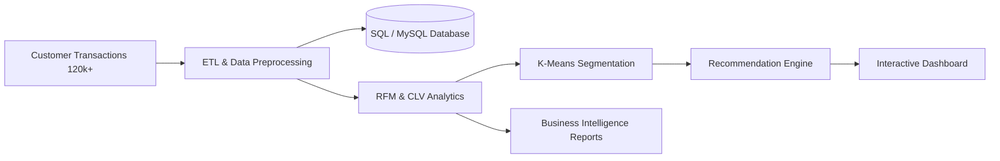

<div align="center">

# 🚀 Customer Behavior Analytics & Recommendation System

### Intelligent Customer Segmentation, Analytics & Recommendation Platform

<br>


</div>

---

# 📌 Overview

**Customer Behavior Analytics & Recommendation System** is a recruiter-focused, portfolio-ready analytics platform designed to process and analyze large-scale customer transaction datasets.

The system performs:
- Customer behavior analytics
- RFM segmentation
- Customer Lifetime Value (CLV) analysis
- K-Means clustering
- Revenue and retention analytics
- Recommendation generation
- Interactive dashboard visualization

The project demonstrates strong practical implementation of:
- Data Analytics
- Machine Learning
- SQL-based processing
- Customer Segmentation
- Business Intelligence workflows

Built using modern analytics and machine learning technologies including **Python**, **Pandas**, **Scikit-Learn**, **SQL**, and **Streamlit**.

---

# 🎯 Key Highlights

✅ Processed and analyzed **120,000+ customer transaction records**  
✅ Implemented complete ETL and preprocessing pipeline  
✅ Built customer segmentation using **RFM Analysis + K-Means Clustering**  
✅ Developed recommendation engine for personalized suggestions  
✅ Generated business insights using interactive dashboards  
✅ Created BI-compatible exports for Power BI/Tableau integration  
✅ Portfolio-ready analytics project with production-style structure  

---

# 🏗️ System Architecture



---

# ✨ Features

---

## 📊 Customer Analytics

- Revenue trend analysis
- Customer retention analysis
- Repeat customer insights
- Purchase frequency tracking
- Product category performance
- Segment-wise revenue monitoring
- Customer Lifetime Value (CLV) tracking

---

## 🧠 Machine Learning & Segmentation

- RFM Analysis
  - Recency
  - Frequency
  - Monetary scoring
- Customer segmentation using K-Means clustering
- Elbow Method for optimal cluster selection
- Cluster visualization and interpretation
- Behavioral customer grouping

---

## 🎯 Recommendation System

- Personalized recommendation engine
- Product suggestions based on customer behavior
- Segment-based recommendations
- Purchase-pattern-driven insights

---

## 📈 Dashboard & Visualization

- Interactive analytics dashboard
- KPI cards and trend analysis
- Customer segment visualization
- Revenue and retention charts
- Heatmaps and cluster visualizations
- BI export compatibility

---

# 🧰 Tech Stack

| Category | Technologies |
|---|---|
| Programming Language | Python |
| Data Analysis | Pandas, NumPy |
| Machine Learning | Scikit-Learn |
| Visualization | Plotly, Matplotlib, Seaborn |
| Dashboard | Streamlit |
| Database | SQL, MySQL |
| Notebook Environment | Jupyter Notebook |
| BI Compatibility | Power BI / Tableau Compatible CSV Exports |

---

# 📂 Project Structure

```text
Customer-Behavior-Analytics-and-Recommendation-System/
│
├── data/
│   ├── raw/
│   └── processed/
│
├── notebooks/
│
├── sql/
│
├── dashboard/
│
├── models/
│
├── preprocessing/
│
├── recommendation/
│
├── visualizations/
│
├── reports/
│
├── screenshots/
│
├── src/
│
├── outputs/
│
├── requirements.txt
├── README.md
└── main.py
```

---

# ⚙️ Installation & Setup Guide

## 📌 Prerequisites

Make sure the following are installed:

- Python 3.10+
- pip
- Git
- MySQL (Optional)
- Jupyter Notebook

---

# 1️⃣ Clone Repository

```bash
git clone https://github.com/swain2003/Customer-Behavior-Analytics-and-Recommendation-System.git

cd Customer-Behavior-Analytics-and-Recommendation-System
```

---

# 2️⃣ Create Virtual Environment

## Windows (PowerShell)

```powershell
python -m venv .venv

.venv\Scripts\Activate.ps1
```

---

## Linux / macOS

```bash
python -m venv .venv

source .venv/bin/activate
```

---

# 3️⃣ Install Dependencies

## Using requirements.txt

```bash
pip install -r requirements.txt
```

---

## If requirements.txt is unavailable

```bash
pip install pandas numpy scikit-learn matplotlib seaborn plotly streamlit jupyter mysql-connector-python
```

---

# 4️⃣ Database Configuration (Optional)

If using MySQL integration:

```sql
CREATE DATABASE customer_analytics;
```

Update database configuration inside the project accordingly.

---

# 5️⃣ Run Data Pipeline

```bash
python main.py
```

Or generate larger datasets:

```bash
python main.py --rows 120000
```

---

# 6️⃣ Launch Dashboard

```bash
streamlit run dashboard/streamlit_app.py
```

---

# 🌐 Dashboard URL

```text
http://localhost:8501
```

---

# 📓 Run Jupyter Notebook

```bash
jupyter notebook
```

Use notebooks for:
- Exploratory Data Analysis
- Model experimentation
- Visualization testing
- Segmentation analysis

---

# 📊 Analytics Included

- Monthly revenue trend analysis
- Customer Lifetime Value (CLV)
- Customer retention analysis
- Repeat vs first-time customer analysis
- Product category performance
- Segment-wise revenue insights
- Purchase pattern analysis
- High-value customer identification

---

# 📈 Machine Learning Workflow

## RFM Analysis

Customers are scored using:
- Recency
- Frequency
- Monetary Value

Generated segments:
- High Value Customers
- Loyal Customers
- Potential Customers
- At Risk Customers
- Lost Customers

---

## K-Means Clustering

Implemented:
- K-Means segmentation
- Elbow Method
- Cluster visualization
- Customer behavioral grouping

---

# 📸 Screenshots

Add project screenshots inside:

```text
screenshots/
```

Recommended screenshots:
- Dashboard preview
- Revenue trend charts
- RFM segmentation visuals
- K-Means cluster visualization
- Recommendation dashboard

---

# 💼 Business Impact

- Enables targeted marketing campaigns
- Improves customer retention strategies
- Supports personalized recommendations
- Helps identify high-value customers
- Enhances customer engagement insights
- Supports data-driven business decisions

---

# 🧪 Resume-Ready Project Description

> Built an end-to-end Customer Behavior Analytics & Recommendation System processing 120k+ customer transactions using Python, SQL, Pandas, and Scikit-Learn. Implemented RFM analysis, K-Means customer segmentation, CLV tracking, and personalized recommendation workflows while developing interactive dashboards for analytics and business intelligence reporting.

---

# 📌 Future Improvements

- Real-time recommendation engine
- Deep learning-based recommendation models
- Cloud deployment
- Kafka/Spark-based streaming pipeline
- User authentication for dashboard access
- REST API integration

---

# 👨‍💻 Author

## Anubhaba Swain
### B.Tech in Information Technology | KIIT University

🔗 LinkedIn: https://www.linkedin.com/in/anubhaba-swain-695a7b176

---

# ⭐ Support

If you found this project useful, consider giving the repository a ⭐ on GitHub.

---
