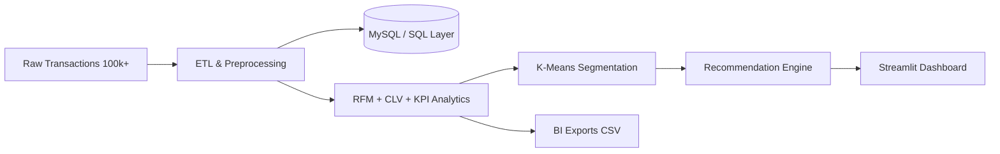

# 🚀 Customer Behavior Analytics & Recommendation System


A recruiter-grade, portfolio-ready end-to-end analytics system that processes **100k+ customer transactions**, performs **RFM segmentation + K-Means clustering**, and delivers **personalized recommendations** via an interactive dashboard.

## 📌 Project Overview
This project simulates realistic customer transaction behavior, builds a full ETL pipeline, stores data in SQL-compatible structures, and powers business-facing analytics and recommendations.

## 🏗️ Architecture


## 🧰 Tech Stack
- **Language:** Python
- **Data:** Pandas, NumPy
- **ML:** Scikit-learn (K-Means, Elbow Method)
- **Database:** SQL / MySQL scripts + integration module
- **Dashboard:** Streamlit
- **Visualization:** Plotly, Matplotlib, Seaborn
- **Notebook:** Jupyter
- **BI Compatibility:** CSV exports for Power BI / Tableau

## ✨ Feature Highlights
- End-to-end ETL pipeline for 120,000+ records
- Missing value handling, duplicate cleanup, feature engineering
- CLV analysis, retention insights, repeat customer analytics
- Product/category performance + segment-wise revenue tracking
- RFM score generation with recruiter-friendly segment labels
- K-Means clustering + elbow diagnostics + cluster visualization
- Popularity-based and segment-based recommendation engine
- Interactive Streamlit dashboard with KPIs, filters, and charts

## 📁 Professional Structure
```text
customer_behavior_analytics/
│
├── data/
├── notebooks/
├── sql/
├── dashboard/
├── models/
├── preprocessing/
├── recommendation/
├── visualizations/
├── reports/
├── screenshots/
├── requirements.txt
├── README.md
└── main.py
```

## ⚙️ Setup Instructions
```bash
git clone <repo-url>
cd Customer-Behavior-Analytics-and-Recommendation-System
python -m venv .venv
source .venv/bin/activate  # Windows: .venv\Scripts\activate
pip install -r requirements.txt
python main.py --rows 120000
streamlit run dashboard/streamlit_app.py
```

## 🖼️ Screenshots
- Dashboard UI preview: `screenshots/dashboard.png`
- Cluster plot: `visualizations/cluster_scatter.png`

## 📊 Analytics Insights Included
- Monthly revenue trend and seasonality
- Top customer and CLV tracking
- Segment-level contribution insights
- Repeat vs first-time customer behavior
- Product category performance and purchase patterns

## 💼 Business Impact
- Enables targeted campaigns through high-value/at-risk identification
- Improves merchandising with recommendation signals
- Supports executive monitoring with KPI cards and trend visuals
- Delivers BI-ready exports for downstream reporting

## 🧠 Resume-Ready Project Description
> Built an end-to-end Customer Behavior Analytics & Recommendation System processing **120k+ transactions** using **Python, SQL, Pandas, and Scikit-learn**. Implemented **RFM analysis**, **K-Means segmentation**, **CLV tracking**, and a **personalized recommendation engine**, and deployed insights in an interactive **Streamlit dashboard** with BI-compatible exports.
